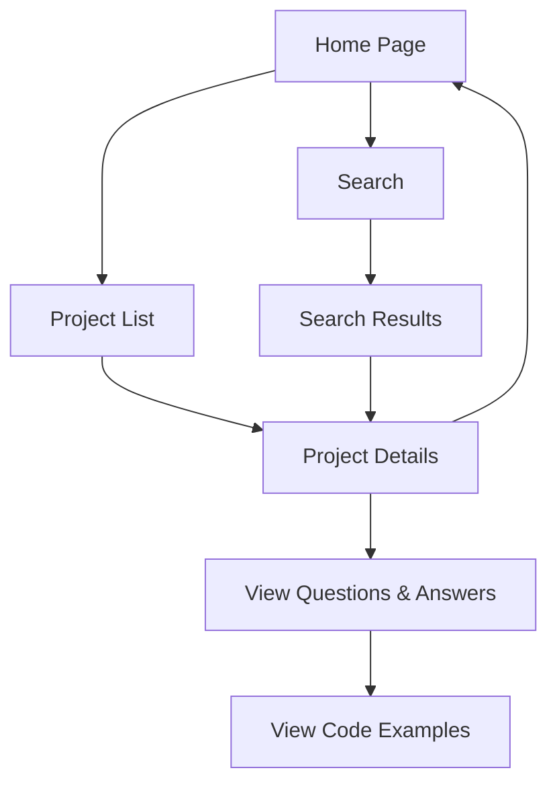

## 1. Product Overview
商务数据分析教学内容网页，提供10个项目的详细问题和答案，帮助用户学习数据分析技能。
- 主要目的是为学习者提供结构化的数据分析教学内容，涵盖数据清洗、漏斗分析、RFM分析等核心领域。
- 目标用户为数据分析师、商务分析师、数据科学学生以及希望提升数据分析能力的职场人士。

## 2. Core Features

### 2.1 User Roles
| Role | Registration Method | Core Permissions |
|------|---------------------|------------------|
| Learner | No registration required | Browse all content, view questions and answers |

### 2.2 Feature Module
1. **Home page**: Navigation menu, project list, search functionality
2. **Project details page**: Project content, questions and answers, code examples
3. **Search results page**: Search functionality, filtered results

### 2.3 Page Details
| Page Name | Module Name | Feature description |
|-----------|-------------|---------------------|
| Home page | Navigation menu | Provides access to all 10 projects, search bar |
| Home page | Project list | Displays all 10 projects with brief descriptions, clickable to details |
| Project details page | Project content | Shows detailed questions and answers for selected project |
| Project details page | Code examples | Displays code snippets with syntax highlighting |
| Search results page | Search functionality | Allows users to search across all projects for specific topics |

## 3. Core Process
User visits the home page → browses project list → clicks on a project → views detailed questions and answers → can search for specific topics → navigates back to home page to explore other projects.

## 4. User Interface Design
### 4.1 Design Style
- Primary color: #1a56db (professional blue)
- Secondary color: #e2e8f0 (light gray for backgrounds)
- Accent color: #3b82f6 (bright blue for highlights)
- Button style: Rounded corners, subtle hover effects
- Font: Inter (modern sans-serif)
- Layout style: Card-based design with clean typography
- Icon style: Minimalist line icons

### 4.2 Page Design Overview
| Page Name | Module Name | UI Elements |
|-----------|-------------|-------------|
| Home page | Navigation menu | Fixed top navigation with project links, search bar |
| Home page | Project list | Grid of cards with project titles, brief descriptions, and icons |
| Project details page | Project content | Clean typography, collapsible sections for questions, code blocks with syntax highlighting |
| Search results page | Search functionality | Search bar at top, filtered results displayed as cards |

### 4.3 Responsiveness
- Desktop-first design with mobile-adaptive layout
- Breakpoints: 1200px (desktop), 768px (tablet), 480px (mobile)
- Mobile optimization: Stacked cards, collapsible navigation

### 4.4 3D Scene Guidance
Not applicable for this project.