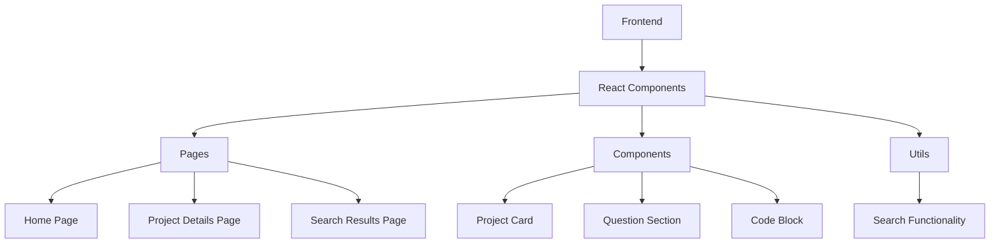
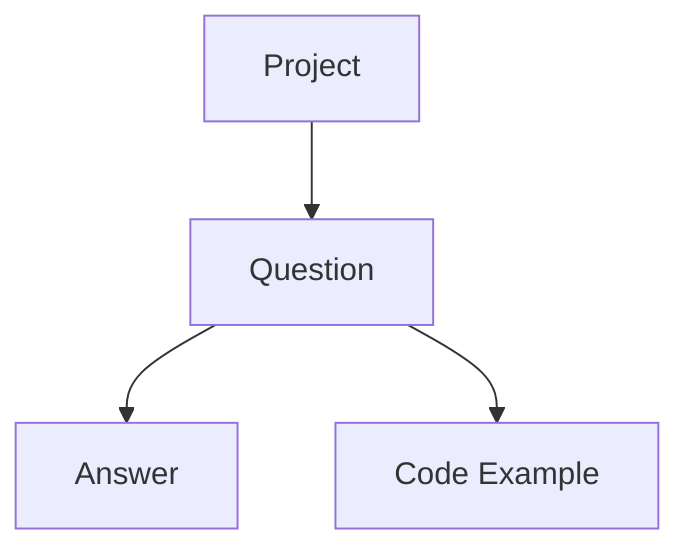

## 1. Architecture Design


## 2. Technology Description
- Frontend: React@18 + tailwindcss@3 + vite
- Initialization Tool: vite-init
- Backend: None (pure frontend application)
- Database: None (static content)

## 3. Route Definitions
| Route | Purpose |
|-------|---------|
| / | Home page with project list |
| /project/:id | Project details page |
| /search | Search results page |

## 4. API Definitions
Not applicable for this project (pure frontend).

## 5. Server Architecture Diagram
Not applicable for this project (pure frontend).

## 6. Data Model
### 6.1 Data Model Definition


### 6.2 Data Definition Language
Not applicable for this project (static content).

## 7. Project Structure
```
/src
  /components
    /ProjectCard.tsx
    /QuestionSection.tsx
    /CodeBlock.tsx
    /SearchBar.tsx
  /pages
    /HomePage.tsx
    /ProjectDetails.tsx
    /SearchResults.tsx
  /data
    /projects.ts
  /utils
    /search.ts
  /styles
    /global.css
  App.tsx
  main.tsx
  routes.tsx
```

## 8. Implementation Notes
- Use React Router for navigation
- Use Tailwind CSS for styling
- Use Prism.js for code syntax highlighting
- Implement responsive design with Tailwind breakpoints
- Use static data for projects and questions
- Implement client-side search functionality